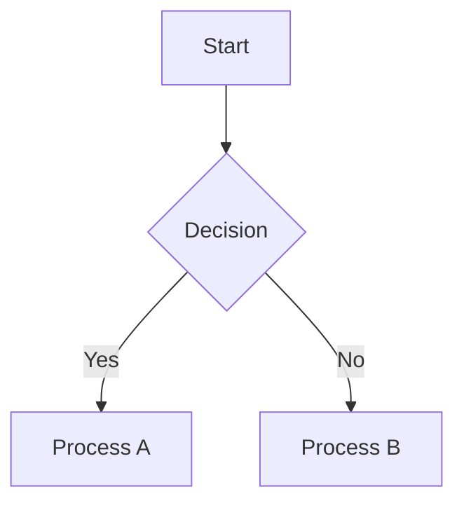

# md2mdocx

Convert Markdown to manual-style Word documents (docx). Generates clean, professional documentation with cover pages, change history, and table of contents.

output sample： [md2docx-sample](./sample/sample.pdf)

## Features

- Auto-generates cover page, change history, and table of contents
- Headers and footers included
- Supports headings, lists, tables, code blocks, and images
- Inline markup (bold, italic, strikethrough, inline code)

## Installation

```bash
npm install -g md2mdocx
```

## Usage

### Basic

```bash
md2mdocx input.md output.docx
```

### Options

| Option | Description | Default |
|--------|-------------|---------|
| `--title` | Product name/title | 製品名 |
| `--subtitle` | Subtitle | マニュアル |
| `--doctype` | Document type | 操作マニュアル |
| `--version` | Version | 1.0.0 |
| `--date` | Creation date | Today's date |
| `--dept` | Department name | 技術開発部 |
| `--docnum` | Document number | DOC-001 |
| `--logo` | Logo image path | None |
| `--company` | Company name | サンプル株式会社 |
| `--theme` | Color theme | blue |

#### Theme Options

| Theme | Description | Mermaid Theme |
|-------|-------------|---------------|
| `blue` | Blue accent (default) | default |
| `orange` | Orange accent | neutral |
| `green` | Green accent | forest |

The theme affects:
- Header border line color
- Change history table header background color
- Mermaid diagram color scheme

### Example

```bash
md2mdocx manual.md manual.docx \
  --title "MyApp" \
  --doctype "User Manual" \
  --version "2.0.0" \
  --company "ABC Corp" \
  --dept "Development" \
  --theme green
```

## Markdown Syntax

### Change History

You can include change history in your Markdown using HTML comments:

```markdown
<!-- CHANGELOG -->
| Version | Date | Changes |
|---------|------|---------|
| 1.0.0 | Jan 1, 2025 | Initial release |
| 1.1.0 | Feb 1, 2025 | Added features |
<!-- /CHANGELOG -->
```

### Images

```markdown

```

You can also specify size using HTML img tags:

```html

```

### Line Breaks and Page Breaks

```markdown
This is line 1.<br>This is line 2.

<pagebreak>

This content appears on a new page.
```

| Syntax | Effect |
|--------|--------|
| `<br>` | Force line break within paragraph |
| `<pagebreak>` | Force page break |

### Mermaid Diagrams

Mermaid code blocks are automatically converted to PNG images using [Kroki](https://kroki.io) API:

~~~markdown

~~~

- Requires internet connection for rendering
- Images are displayed at original size, scaled down if exceeding page width
- If rendering fails, a warning message is shown in the document

## Notes

### Opening Generated Documents

When opening the generated Word document, you may see a dialog:

> "This document contains fields that may refer to other files. Do you want to update the fields in this document?"

This is because the document contains fields such as table of contents (TOC) and page numbers. Select **Yes** to update them to the latest state.

## License

MIT
