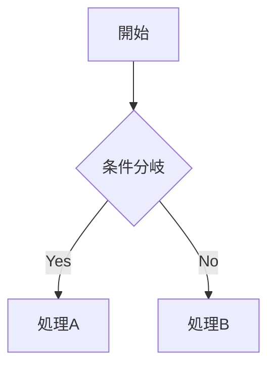

# md2mdocx

Markdownをマニュアル形式のWord文書(docx)に変換するツールです。そこそこ綺麗なマニュアル形式のドキュメントに変換します。

出力例： [md2docx-sample](./sample/sample.pdf)

主に自分用に作ったものなので、予告なく仕様変更が入ることがあります。

## 機能

- 表紙、変更履歴、目次を自動生成
- ヘッダー/フッター付き
- 見出し、箇条書き、テーブル、コードブロック、画像に対応
- インラインマークアップ(太字、斜体、取り消し線、インラインコード)

## インストール

```bash
bun install
```

## 使い方

### 基本

```bash
bun md2docx.js input.md output.docx
```

### オプション

| オプション | 説明 | デフォルト値 |
|-----------|------|-------------|
| `--title` | 製品名/タイトル | 製品名 |
| `--subtitle` | サブタイトル | マニュアル |
| `--doctype` | 文書種別 | 操作マニュアル |
| `--version` | バージョン | 1.0.0 |
| `--date` | 作成日 | 今日の日付 |
| `--dept` | 部署名 | 技術開発部 |
| `--docnum` | 文書管理番号 | DOC-001 |
| `--logo` | ロゴ画像パス | なし |
| `--company` | 会社名 | サンプル株式会社 |

### 使用例

```bash
bun md2docx.js manual.md manual.docx \
  --title "MyApp" \
  --doctype "ユーザーマニュアル" \
  --version "2.0.0" \
  --company "株式会社ABC" \
  --dept "開発部"
```

## Makefileを使う場合

```bash
# デフォルト設定で変換
make

# カスタマイズ
make TITLE="製品名" VERSION="2.0.0" COMPANY="株式会社ABC"

# クリーン
make clean

# 再生成
make rebuild

# ヘルプ
make help
```

## Markdown記法

### 変更履歴

Markdown内にHTMLコメントで変更履歴を記述できる。

```markdown
<!-- CHANGELOG -->
| バージョン | 変更日付 | 変更事由 |
|-----------|---------|---------|
| 1.0.0 | 2025年1月1日 | 初版作成 |
| 1.1.0 | 2025年2月1日 | 機能追加 |
<!-- /CHANGELOG -->
```

### 画像

```markdown

```

HTMLのimgタグでサイズ指定も可能。

```html

```

### Mermaid図

Mermaidコードブロックは[Kroki](https://kroki.io) APIを使用してPNG画像に自動変換されます。

~~~markdown

~~~

- レンダリングにはインターネット接続が必要
- 原寸サイズで表示、ページ幅を超える場合は縮小
- レンダリング失敗時はドキュメントに警告メッセージを表示

## 注意事項

### 生成されたドキュメントを開く際

生成されたWord文書を開くと、以下のようなダイアログが表示されることがあります。

> 「この文書には他のファイルを参照するフィールドが含まれています。この文書のフィールドを更新してもよろしいですか?」

これは目次(TOC)やページ番号などのフィールドが含まれているためです。**はい**を選択して最新の状態に更新してください。
