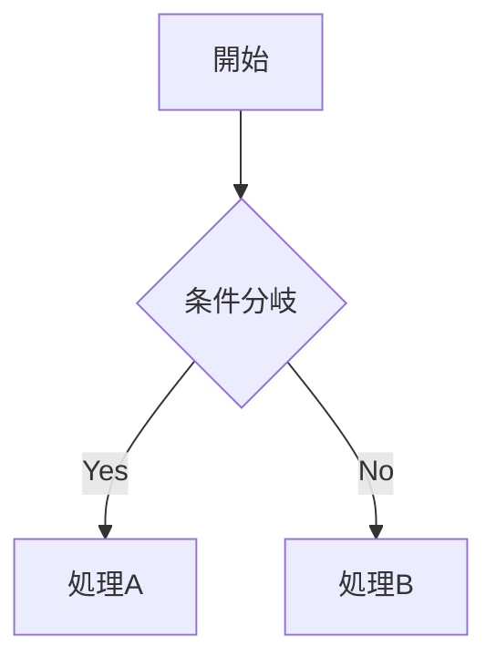

# md2mdocx

Markdownをマニュアル形式のWord文書(docx)に変換するツールです。そこそこ綺麗なマニュアル形式のドキュメントに変換します。

出力例： [md2docx-sample](./sample/sample.pdf)

主に自分用に作ったものなので、予告なく仕様変更が入ることがあります。

## 機能

- 表紙、変更履歴、目次を自動生成
- ヘッダー/フッター付き
- 見出し、箇条書き、テーブル、コードブロック、画像に対応
- インラインマークアップ(太字、斜体、取り消し線、インラインコード)

## 使い方

### クイックスタート（推奨）

インストール不要。`npx`または`bunx`で直接実行できます:

```bash
npx md2mdocx input.md output.docx
# または
bunx md2mdocx input.md output.docx
```

### グローバルインストール

```bash
npm install -g md2mdocx
# その後
md2mdocx input.md output.docx
```

### オプション

| オプション | 説明 | デフォルト値 |
|-----------|------|-------------|
| `--title` | 製品名/タイトル | 製品名 |
| `--subtitle` | サブタイトル | マニュアル |
| `--doctype` | 文書種別 | 操作マニュアル |
| `--version` | バージョン | 1.0.0 |
| `--date` | 作成日 | 今日の日付 |
| `--dept` | 部署名 | 技術開発部 |
| `--docnum` | 文書管理番号 | DOC-001 |
| `--logo` | ロゴ画像パス | なし |
| `--company` | 会社名 | サンプル株式会社 |
| `--theme` | カラーテーマ | blue |
| `--config` | 設定ファイルパス | (自動検出) |
| `--hr-pagebreak` | `---`を改ページとして扱う | true |
| `--save-config` | 現在の設定をYAMLファイルに保存 | - |

#### 設定ファイル (YAML)

オプションはYAMLファイルでも指定できます。デフォルトでは、入力`.md`ファイルと同じパスにある`input.yaml`が自動的に読み込まれます。

```yaml
title: "製品名"
subtitle: "マニュアル"
doctype: "操作マニュアル"
version: "2.0.0"
date: "2025年1月1日"
dept: "開発部"
docnum: "DOC-001"
company: "株式会社ABC"
theme: "blue"
hr-pagebreak: true
# logo: "logo.png"
```

**優先順位:** コマンドライン引数 > 設定ファイル > デフォルト値

#### 設定の保存

`--save-config`で現在の設定（デフォルト値含む）をYAMLファイルに保存できます:

```bash
# デフォルト設定を保存
npx md2mdocx --save-config config.yaml

# カスタム設定を含めて保存
npx md2mdocx --save-config config.yaml --title "製品名" --theme orange

# 既存の設定を読み込み、変更して保存
npx md2mdocx --save-config new-config.yaml --config existing.yaml --version "2.0.0"
```

- 拡張子は自動的に`.yaml`に設定されます
- 値が`null`のオプションは出力されません
- `--option=`（イコール付き）で空文字を設定できます

#### テーマオプション

| テーマ | 説明 | Mermaidテーマ |
|-------|------|---------------|
| `blue` | 青系（デフォルト） | default |
| `orange` | オレンジ系 | neutral |
| `green` | 緑系 | forest |

テーマは以下に適用されます:
- ヘッダー下線の色
- 変更履歴テーブルのヘッダー背景色
- Mermaid図の配色

### 使用例

```bash
npx md2mdocx manual.md manual.docx \
  --title "MyApp" \
  --doctype "ユーザーマニュアル" \
  --version "2.0.0" \
  --company "株式会社ABC" \
  --dept "開発部" \
  --theme green
```

## Makefileを使う場合

```bash
# デフォルト設定で変換
make

# カスタマイズ
make TITLE="製品名" VERSION="2.0.0" COMPANY="株式会社ABC"

# クリーン
make clean

# 再生成
make rebuild

# ヘルプ
make help
```

## Markdown記法

### 変更履歴

Markdown内にHTMLコメントで変更履歴を記述できる。

```markdown
<!-- CHANGELOG -->
| バージョン | 変更日付 | 変更事由 |
|-----------|---------|---------|
| 1.0.0 | 2025年1月1日 | 初版作成 |
| 1.1.0 | 2025年2月1日 | 機能追加 |
<!-- /CHANGELOG -->
```

### 画像

```markdown

```

HTMLのimgタグでサイズ指定も可能。

```html

```

### 強制改行・強制改ページ

```markdown
これは1行目です。<br>これは2行目です。

<pagebreak>

ここから新しいページです。
```

| 記法 | 効果 |
|------|------|
| `<br>` | 段落内で強制改行 |
| `<pagebreak>` | 強制改ページ |
| `<div style="page-break-before:always"></div>` | 強制改ページ（HTML形式） |
| `---` | 改ページ（`--hr-pagebreak true`時、デフォルト）または水平線 |

### HTMLコメント制御

既存のMarkdownファイル（READMEなど）をそのまま使う場合、HTMLコメントでパース範囲を制御できます。

```markdown
# プロジェクト名（スキップされる）

バッジやリンクなど...

<!-- md2mdocx:start -->

# ドキュメント開始

変換される内容...

<!-- md2mdocx:pagebreak -->

# 新しいページ

<!-- md2mdocx:br -->

上に空行が挿入される。

<!-- md2mdocx:end -->

## 付録（スキップされる）
```

| コメント | 効果 |
|---------|------|
| `<!-- md2mdocx:start -->` | この行以降からパース開始（前の内容をスキップ） |
| `<!-- md2mdocx:end -->` | この行でパース終了（後の内容をスキップ） |
| `<!-- md2mdocx:pagebreak -->` | 強制改ページ |
| `<!-- md2mdocx:br -->` | 空行を挿入 |

### Mermaid図

Mermaidコードブロックは[Kroki](https://kroki.io) APIを使用してPNG画像に自動変換されます。

~~~markdown

~~~

- レンダリングにはインターネット接続が必要
- 原寸サイズで表示、ページ幅を超える場合は縮小
- レンダリング失敗時はドキュメントに警告メッセージを表示

## 注意事項

### 生成されたドキュメントを開く際

生成されたWord文書を開くと、以下のようなダイアログが表示されることがあります。

> 「この文書には他のファイルを参照するフィールドが含まれています。この文書のフィールドを更新してもよろしいですか?」

これは目次(TOC)やページ番号などのフィールドが含まれているためです。**はい**を選択して最新の状態に更新してください。
