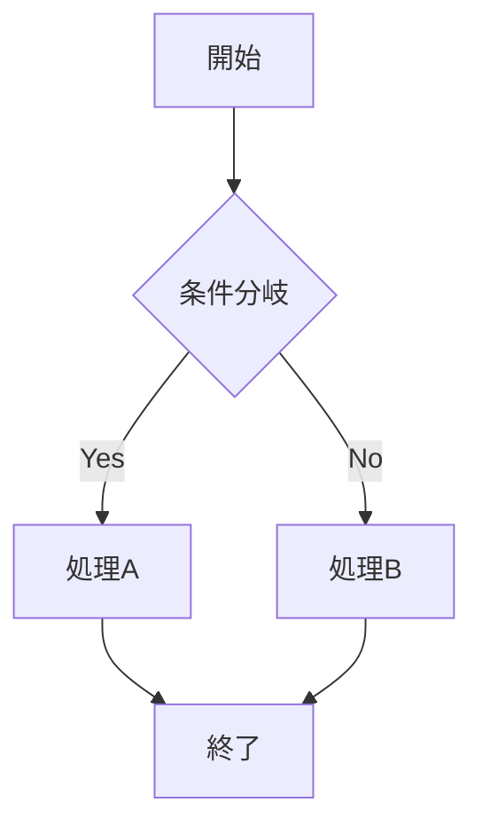
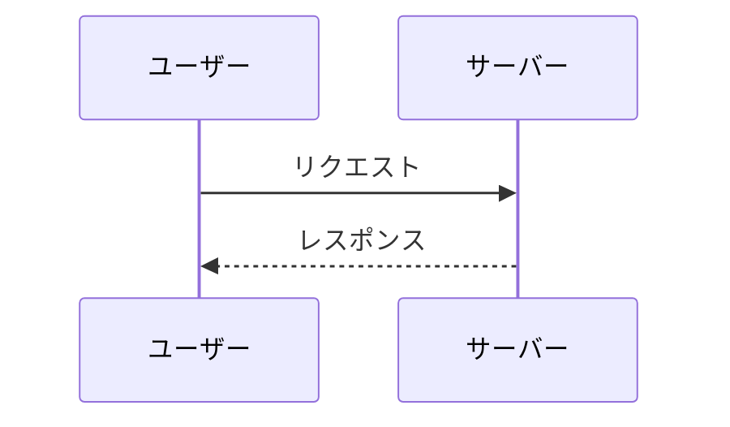

# Mermaidテスト

## フローチャート

```mermaid
graph TD
    A[開始] --> B{条件分岐}
    B -->|Yes| C[処理A]
    B -->|No| D[処理B]
    C --> E[終了]
    D --> E
```

## シーケンス図

```mermaid
sequenceDiagram
    participant A as ユーザー
    participant B as サーバー
    A->>B: リクエスト
    B-->>A: レスポンス
```
